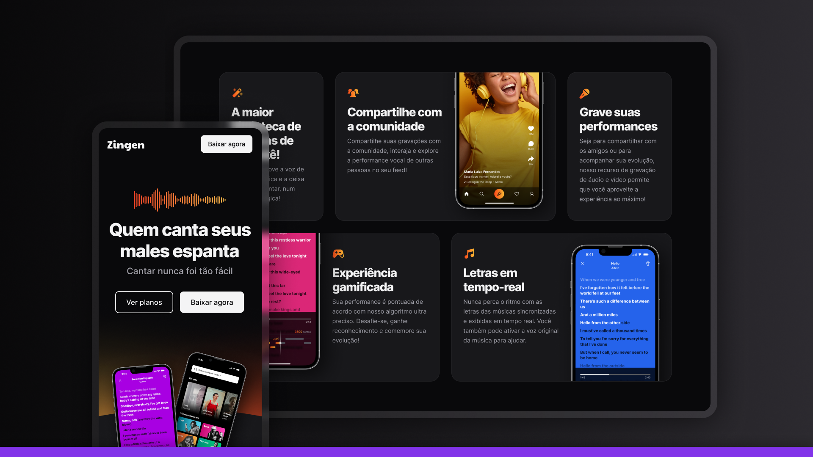

# 🎵 Zingen

## 📋 About the Project

This project is a landing page for a music streaming platform, developed to enhance front-end skills and modern web development practices. The site features an elegant interface with sections such as hero, features, pricing plans, and app download.

The layout was built with responsiveness in mind, featuring both mobile and desktop versions, using modern CSS techniques like Grid, Flexbox, and CSS variables.

## 🚀 Technologies Used

- **HTML5** - Semantic page structure
- **CSS3** - Styling with modern techniques
  - **CSS Variables** - For visual consistency and simplified maintenance
  - **Grid Layout** - For complex and responsive layouts
  - **Flexbox** - For alignments and space distribution
  - **Media Queries** - To ensure responsiveness across different devices
  - **Modular CSS** - Organization in multiple files for better maintenance
  - **Pseudo-elements/classes** - For advanced styling

## 🎨 Implemented Features

- **Responsive Design** - Perfect adaptation for mobile and desktop
- **Dark Theme** - Elegant interface with contrasting colors
- **Gradients** - Visual elements with gradients for emphasis
- **Interactive Cards** - Highlighted sections for features and plans
- **Custom Buttons** - Including buttons with hover effects
- **Social Media Icons** - Integration with social networks
- **Optimized Typography** - Typography scale for different devices
- **Grid Layout** - Efficient organization of elements

## 💡 Applied Concepts

- **Modular CSS Architecture** - Code organization across multiple files
- **Mobile-First Design** - Development with mobile devices as the priority
- **Scalability** - Structure prepared for project growth
- **Accessibility** - Elements with ARIA attributes for better accessibility
- **Performance Optimization** - Efficient CSS structure
- **BEM (Block Element Modifier)** - Naming concepts for CSS organization

## 🌟 Next Steps

- JavaScript implementation to add interactivity
- Integration with music APIs
- User login and registration area
- Functional music player

Design UI/UX by [Rocketseat](https://www.rocketseat.com.br/)

---

 
Developed with ❤️ as part of my web development learning journey.
 
Feel free to contribute or get in touch!
 

